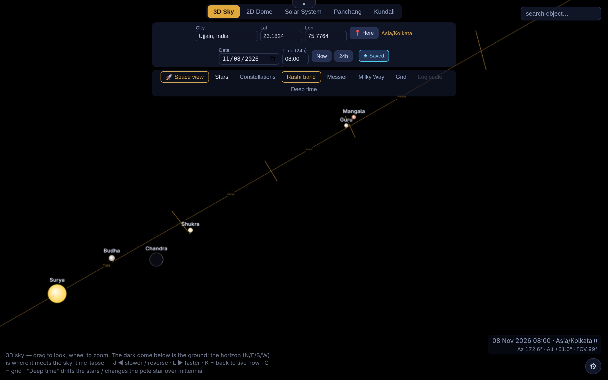
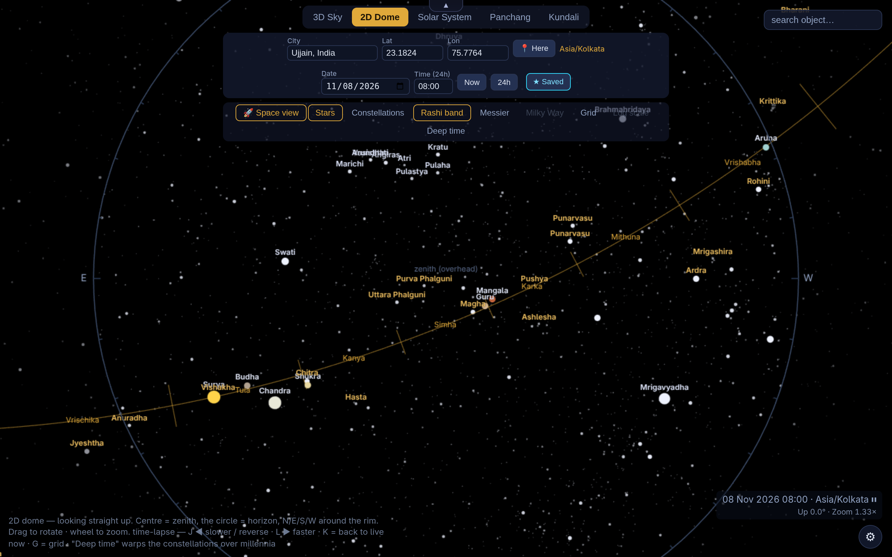
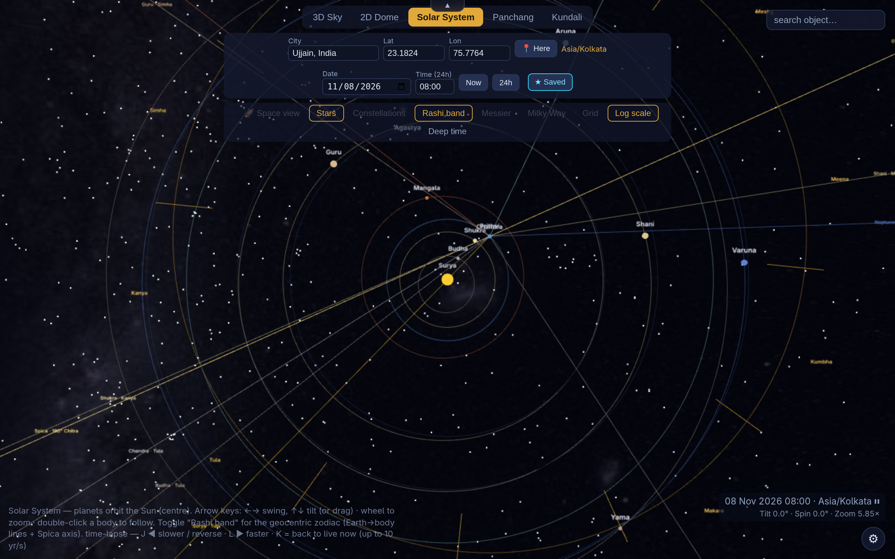
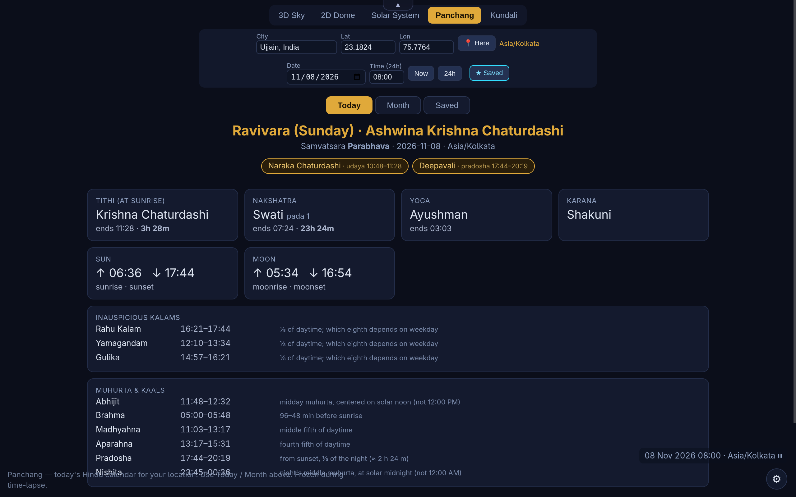
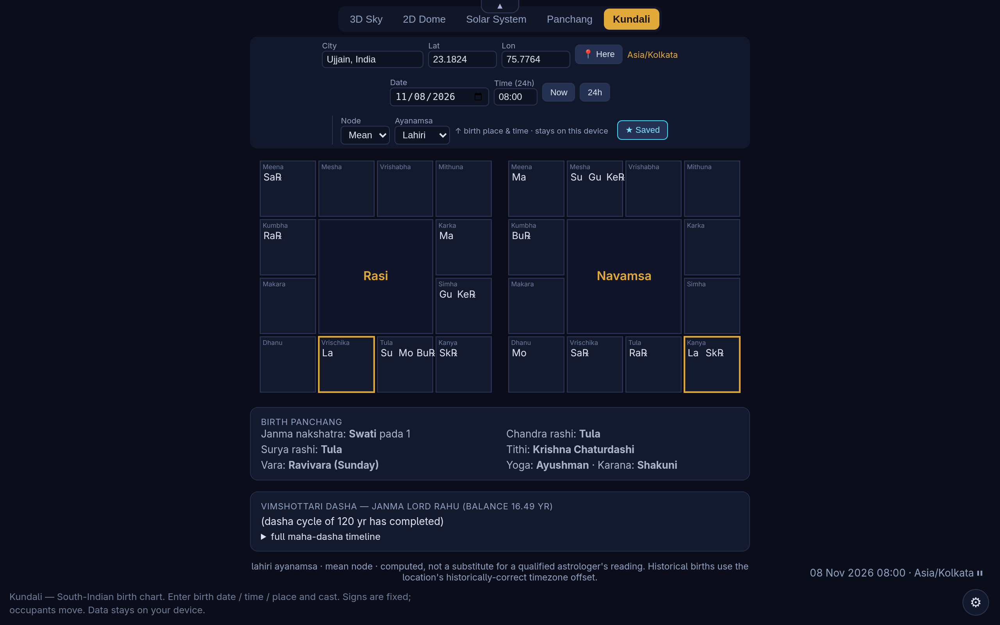
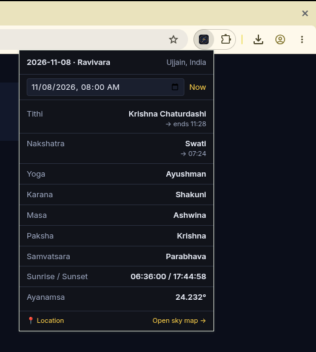
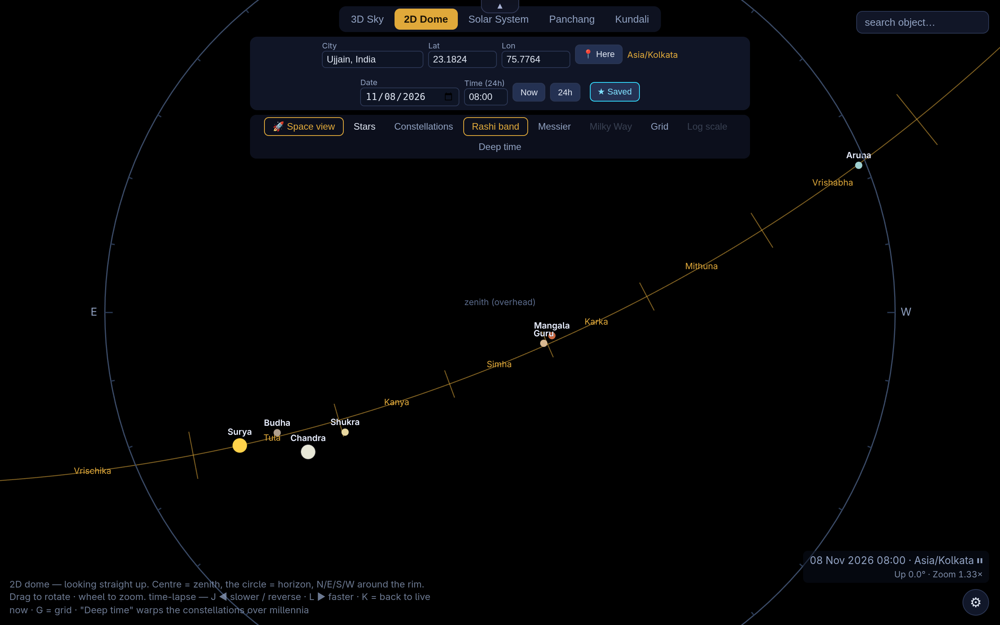

# Khagol — Hindu Panchang & Sky Map

**Khagol** (खगोल, *the celestial sphere*) is an offline browser extension that combines a daily
**Hindu Panchang** (almanac) with an interactive **3D/2D sky map**, a **solar-system orrery** with
the sidereal **Rashi band**, and a **Kundali** (birth chart) — all computed **on your device**.

> 🔒 **100% offline. No internet, no accounts, no tracking.** Every position is calculated locally
> with the Swiss Ephemeris (Moshier mode) compiled to WebAssembly; nothing you enter ever leaves
> your browser.

  

---

## Screenshots

| 3D Sky | 2D Dome | Solar System |
|---|---|---|
|  |  |  |

| Panchang | Kundali | Popup |
|---|---|---|
|  |  |  |

The **Stars** toggle in action — the 2D dome with and without the catalogue star field:

| Stars on | Stars off |
|---|---|
|  |  |

---

## Features

- **Daily Panchang** — tithi, nakshatra, yoga, karana and vara, plus masa, paksha, samvatsara,
  sunrise/sunset, and the day-quality windows (Rahu Kalam, Yamagandam, Gulika, hora, choghadiya,
  abhijit, brahma muhurta). Handles kshaya/vriddhi tithis correctly.
- **Month calendar** with festivals determined by the proper kaal rule
  (udaya / madhyahna / aparahna / pradosha / nishita / chandrodaya).
- **3D sky** — look around a real sky for your location and time; stars, planets, Sun & Moon (with
  phase), constellations, Milky Way, Messier objects, an alt-az grid, and the ecliptic.
- **2D dome** — the whole sky at a glance (zenith at centre, horizon at the rim).
- **Solar-system orrery** — planets orbiting the Sun to scale, with an optional **Rashi band**
  showing the geocentric sidereal zodiac (Earth→planet lines + the Chitra/Spica axis).
- **Kundali** — a South-Indian birth chart for any date, time and place (lagna, grahas, navamsa,
  Vimshottari dasha).
- **Saved dates** — save a place + date/time; it recurs each year by **tithi + masa** and is marked
  ★ in Today and the Month calendar. Load it back into the Panchang, Kundali, or sky map.
- **Hindu or English names** — graha/nakshatra names show in **Hindu by default** (Surya, Chandra,
  Chitra, Rohini…); switch to English in settings.
- **Deep time** — drift the stars and pole star over millennia.

## Install

**From the stores** *(links added when published):*
- 🦊 Firefox Add-ons — *coming soon*
- 🌐 Chrome Web Store — *coming soon*

**Load it yourself (no store needed):**
- **Firefox:** `about:debugging` → *This Firefox* → *Load Temporary Add-on…* → pick `manifest.json`.
- **Chrome / Edge:** `chrome://extensions` → enable *Developer mode* → *Load unpacked* → select this
  folder.

## How to use & explore

Click the toolbar icon for a quick **popup** with today's Panchang, or open the full view for
everything. The top bar switches between **3D Sky · 2D Dome · Solar System · Panchang · Kundali**.

**Set where & when** (shared by every view):
- **City** search, or type **Lat/Lon**, or **📍 Here** for your current location.
- **Date** and **Time** (24h), or **Now** to snap back to live; toggle **12h/24h**.
- In **Kundali** these fields mean the *birth* place & time, and **Node / Ayanamsa** (Lahiri, Raman,
  KP) appear.

**Move around the sky:**
- **Drag** to look around · **mouse-wheel** to zoom.
- **Arrow keys** — ←→ swing, ↑↓ tilt (in the orrery, or pan in 3D/2D).
- **Double-click** a body in the orrery to follow it.
- **Time-lapse** — `J` slower/reverse · `L` faster · `K` back to live now (up to years per second).
- `G` toggles the grid.

**Toggles** (top of the sky views): Space view (no atmosphere), Stars, Constellations, **Rashi
band**, Messier, Milky Way, Grid, Log scale (orrery), Deep time.

**Search** any object by name — including its **Hindu name** (try *Chitra*, *Rohini*, *Chandra*) —
to highlight and center it.

**Settings** (⚙): ayanamsa, language mode (Hindu/English), show Uranus & Neptune, atmosphere default,
orrery scale. Export the current sky view as a PNG, or print the Kundali.

> 📖 Want the exact rules behind the calendar? See **[docs/PANCHANG_TRIGGERS.md](docs/PANCHANG_TRIGGERS.md)** —
> which element is decided by which instant (sunrise, sunset, midnight, moonrise…), and a worked
> example of how sensitive sunrise-triggered results are to longitude.

## Privacy

Khagol collects nothing and contacts no server. See **[PRIVACY.md](PRIVACY.md)**.

## Build from source

The only build step is the Swiss Ephemeris WASM; everything else ships as plain HTML/CSS/JS + JSON.
Full provenance, pinned toolchain, and a one-command reproducible build are in
**[BUILD.md](BUILD.md)**.

## How it works (brief)

Positions come from the **Swiss Ephemeris in Moshier mode** (`vendor/swe_wasm.c` → `vendor/sweph.wasm`),
which needs no ephemeris data files, so the whole extension is self-contained and works with the
network off. The Panchang/Kundali logic lives in `src/`; the sky/orrery rendering uses a vendored
copy of Three.js. City names and star data are bundled JSON in `data/`.

## License

**[AGPL-3.0](LICENSE).** Khagol links the Swiss Ephemeris, which is AGPL-3.0; accordingly the whole
work is distributed under the GNU Affero General Public License v3.0. The complete corresponding
source — including the Swiss Ephemeris C sources used to build the WASM — is in this repository.
